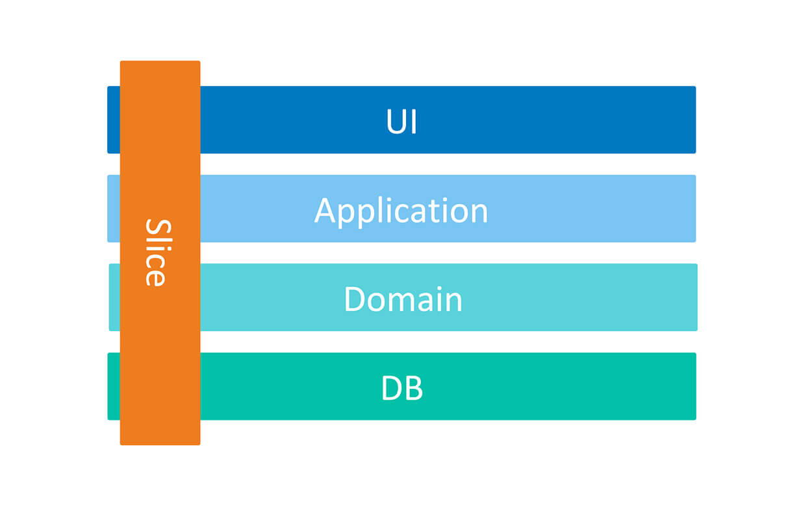
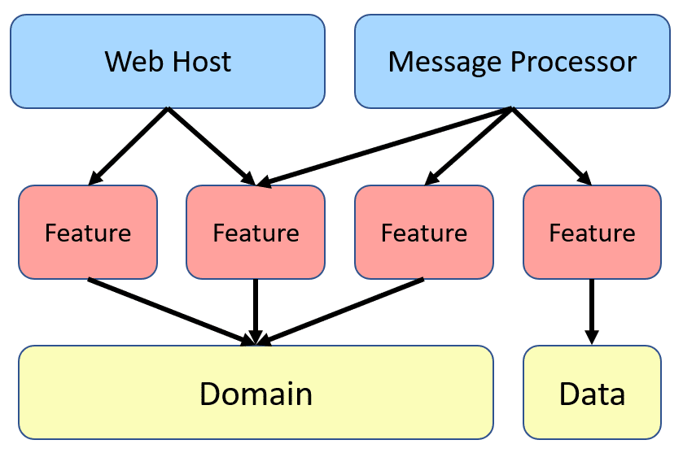
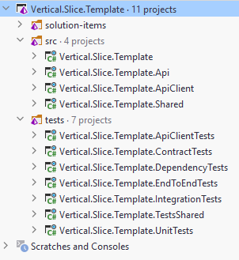

# Vertical Slice API Template
[](https://www.nuget.org/packages/Vertical.Slice.Template)
[](https://github.com/mehdihadeli/vertical-slice-api-template/actions/workflows/ci-cd.yml)
[](http://commitizen.github.io/cz-cli/)

> This is a An `asp.net core template` based on `Vertical Slice Architecture`, CQRS, Minimal APIs, API Versioning and Swagger. Create a new project based on this template by clicking the above **Use this template** button or by installing and running the associated NuGet package (see Getting Started for full details).

## Getting Started & Prerequisites
1. This application uses `Https` for hosting apis, to setup a valid certificate on your machine, you can create a [Self-Signed Certificate](https://learn.microsoft.com/en-us/aspnet/core/security/docker-https?view=aspnetcore-7.0#macos-or-linux), see more about enforce certificate [here](https://learn.microsoft.com/en-us/aspnet/core/security/enforcing-ssl).
2. Install git - [https://git-scm.com/downloads](https://git-scm.com/downloads).
3. Install .NET Core 7.0 - [https://dotnet.microsoft.com/download/dotnet/7.0](https://dotnet.microsoft.com/download/dotnet/7.0).
4. Install Visual Studio, Rider or VSCode.
5. Run `dotnet new install Vertical.Slice.Template` to install the project templates.
6. Now with running `dotnet new --list`, we should see `Vertical.Slice.Template` in the template list.
7. Create a folder for your solution and cd into it (the template will use it as project name)
8. Run `dotnet new vsa` for short name or `dotnet new Vertical.Slice.Template -n <YourProjectName>` to create a new project template.
9. Open [<YourProjectName>.sln](./Vertical.Slice.Template.sln) solution, make sure that's compiling.
9. Navigate to `src/App/<YourProjectName>.Api` and run `dotnet run` to launch the back end (ASP.NET Core Web API)
10. Open web browser https://localhost:5158/swagger Swagger UI

# ⭐ Support

If you like feel free to ⭐ this repository, It helps out :)

Thanks a bunch for supporting me!

# Table of Contents

- [Features](#features)
- [Libraries](#libraries)
- [Setup](#setup)
  - [Dev Certificate](#dev-certificate)
  - [Conventional Commit](#conventional-commit)
  - [Formatting](#formatting)
  - [Analizers](#analizers)
- [Application Structure](#application-structure)
- [Vertical Slice Flow](#vertical-slice-flow)
- [Prerequisites](#prerequisites)
- [How to Run](#how-to-run)
  - [Using PM2](#using-pm2)
  - [Using Tye](#using-tye)
- [Contribution](#contribution)
- [License](#license)

## Features
- ✅ Using `Vertical Slice Architecture` as a high level architecture
- ✅ Using `CQRS Pattern` on top of `MediatR` library
- ✅ Using `Minimal APIs` for handling requests
- ✅ Using `Fluent Validation` and a [Validation Pipeline Behaviour](./src/BuildingBlocks/BuildingBlocks.Validation/RequestValidationBehavior.cs) on top of MediatR
- ✅ Using `Postgres` On Top of EfCore
- ✅ Logging with `Serilog` and `Elasticsearch` and `Kibana` for collecting and searching structured logs
- ✅ Using [Microsoft Tye](https://github.com/dotnet/tye) and `Pm2` for running the application
- 🚧 Using docker and `docker-compose` for deployment
- 🚧 Using `OpenTelemetry` for collection `Metrics` and `Distributed Tracing`

## Libraries
- ✔️ **[`.NET 7`](https://dotnet.microsoft.com/download)** - .NET Framework and .NET Core, including ASP.NET and ASP.NET Core
- ✔️ **[`Npgsql Entity Framework Core Provider`](https://www.npgsql.org/efcore/)** - Npgsql has an Entity Framework (EF) Core provider. It behaves like other EF Core providers (e.g. SQL Server), so the general EF Core docs apply here as well
- ✔️ **[`FluentValidation`](https://github.com/FluentValidation/FluentValidation)** - Popular .NET validation library for building strongly-typed validation rules
- ✔️ **[`Swagger & Swagger UI`](https://github.com/domaindrivendev/Swashbuckle.AspNetCore)** - Swagger tools for documenting API's built on ASP.NET Core
- ✔️ **[`Serilog`](https://github.com/serilog/serilog)** - Simple .NET logging with fully-structured events
- ✔️ **[`Polly`](https://github.com/App-vNext/Polly)** - Polly is a .NET resilience and transient-fault-handling library that allows developers to express policies such as Retry, Circuit Breaker, Timeout, Bulkhead Isolation, and Fallback in a fluent and thread-safe manner
- ✔️ **[`Scrutor`](https://github.com/khellang/Scrutor)** - Assembly scanning and decoration extensions for Microsoft.Extensions.DependencyInjection
- ✔️ **[`Opentelemetry-dotnet`](https://github.com/open-telemetry/opentelemetry-dotnet)** - The OpenTelemetry .NET Client
- ✔️ **[`Newtonsoft.Json`](https://github.com/JamesNK/Newtonsoft.Json)** - Json.NET is a popular high-performance JSON framework for .NET
- ✔️ **[`AspNetCore.Diagnostics.HealthChecks`](https://github.com/Xabaril/AspNetCore.Diagnostics.HealthChecks)** - Enterprise HealthChecks for ASP.NET Core Diagnostics Package
- ✔️ **[`NSubstitute`](https://github.com/nsubstitute/NSubstitute)** - A friendly substitute for .NET mocking libraries.
- ✔️ **[`StyleCopAnalyzers`](https://github.com/DotNetAnalyzers/StyleCopAnalyzers)** - An implementation of StyleCop rules using the .NET Compiler Platform
- ✔️ **[`AutoMapper`](https://github.com/AutoMapper/AutoMapper)** - Convention-based object-object mapper in .NET.
- ✔️ **[`NewID`](https://masstransit.io/documentation/patterns/newid)** - NewId generates sequential unique identifiers that are 128-bit (16-bytes) and fit nicely into a Guid

## Setup

### Dev Certificate
This application uses `Https` for hosting apis, to setup a valid certificate on your machine, you can create a [Self-Signed Certificate](https://learn.microsoft.com/en-us/aspnet/core/security/docker-https#macos-or-linux), see more about enforce certificate [here](https://learn.microsoft.com/en-us/dotnet/core/additional-tools/self-signed-certificates-guide) and [here](https://learn.microsoft.com/en-us/aspnet/core/security/enforcing-ssl).

- Setup on windows and [`powershell`](https://learn.microsoft.com/en-us/dotnet/core/additional-tools/self-signed-certificates-guide#with-dotnet-dev-certs):

```powershell
dotnet dev-certs https --clean
dotnet dev-certs https -ep $env:USERPROFILE\.aspnet\https\aspnetapp.pfx -p <CREDENTIAL_PLACEHOLDER>
dotnet dev-certs https --trust
```

- Setup in [`linux and wsl`](https://learn.microsoft.com/en-us/aspnet/core/security/docker-https?view=aspnetcore-7.0#macos-or-linux):

```bash
dotnet dev-certs https --clean
dotnet dev-certs https -ep ${HOME}/.aspnet/https/aspnetapp.pfx -p <CREDENTIAL_PLACEHOLDER>
dotnet dev-certs https --trust
```

`dotnet dev-certs https --trust` is only supported on macOS and Windows. You need to trust certs on Linux in the way that is supported by your distribution. It is likely that you need to trust the certificate in your browser(with this certificate we don't get an exception for https port because of not found certificate but browser shows us this certificate is not trusted).

### Conventional Commit

In this app I use [Conventional Commit](https://www.conventionalcommits.org/en/) and for enforcing its rule I use [conventional-changelog/commitlint](https://github.com/conventional-changelog/commitlint) and [typicode/husky](https://github.com/typicode/husky) with a pre-commit hook. For read more about its setup see [commitlint docs](https://github.com/conventional-changelog/commitlint#getting-started) and [this article](https://betterprogramming.pub/how-to-lint-commit-messages-with-husky-and-commitlint-b51d20a5e514) and [this article](https://www.code4it.dev/blog/conventional-commit-with-githooks).

Here I configured a husky hook for conventional commits:

1. Install NPM:

```bash
npm init
```

2. Install Husky:

```bash
npm install husky --save-dev
```

3. Add `prepare` and `install-dev-cert-bash` command for installing and activating `husky hooks` in the package.json file:

```bash
npm pkg set scripts.prepare="husky install && dotnet tool restore"

npm pkg set scripts.install-dev-cert-bash="curl -sSL https://aka.ms/getvsdbgsh | bash /dev/stdin -v vs2019 -l ~/vsdbg"
```

4. Install CommitLint:

```bash
npm install --save-dev @commitlint/config-conventional @commitlint/cli
```

5. Create the `commitlint.config.js` file with this content:

```js
module.exports = { extends: '@commitlint/config-conventional']};
```

6. Create the Husky folder:

```bash
mkdir .husky
```

7. Link Husky and CommitLint:

```bash
npx husky add .husky/commit-msg 'npx --no -- commitlint --edit ${1}'
```

8. Activate and installing all husky hooks with this command:

```bash
npm run prepare

# this command should run in git-bash on the windows or bash in the linux
npm run install-dev-cert-bash
```

### Formatting

For formatting I use [belav/csharpier](https://github.com/belav/csharpier) but you can also use `dotnet format`, you can integrate it with your [prefered IDE](https://csharpier.com/docs/Editors).

Here I configured a husky hook for formatting:

1. Install NPM:

```bash
npm init
```

2. Install Husky:

```bash
npm install husky --save-dev
```

3. To install a tool for local access only (for the current directory and subdirectories), it has to be added to a manifest file. So we [Create a manifest file](https://learn.microsoft.com/en-us/dotnet/core/tools/local-tools-how-to-use#create-a-manifest-file) by running the dotnet new command:

``` bash
dotnet new tool-manifest
```

4. Adds the tool to the manifest file that we created in the preceding step and then install our required packages as dependency with [dotnet tool install](https://learn.microsoft.com/en-us/dotnet/core/tools/dotnet-tool-install), that will add to [dotnet-tools.json](.config/dotnet-tools.json) file in a `.config` directory:

```bash
dotnet new tool-manifest

dotnet tool install csharpier
dotnet tool install dotnet-format
```

5. Add `prepare` command for installing and activating `husky hooks` and `restoring` our installed [dotnet tools](.config/dotnet-tools.json) in the previous step to the [package.json](package.json) file:

```bash
npm pkg set scripts.prepare="husky install && dotnet tool restore"
```

6. Create the Husky folder:

```bash
mkdir .husky
```

7. Link Husky and formatting tools:

```bash
npx husky add .husky/pre-commit "dotnet format && git add -A ."

# Or using csharpier
npx husky add .husky/pre-commit "dotnet csharpier . && git add -A ."
```

8. Activate and installing all husky hooks with this command:

```bash
npm run prepare
```

### Analizers

For roslyn analizers I use serveral analyzers and config the in `.editorconfig` file:

- [StyleCop/StyleCop](https://github.com/StyleCop/StyleCop)
- [JosefPihrt/Roslynator](https://github.com/JosefPihrt/Roslynator)
- [meziantou/Meziantou.Analyzer](https://github.com/meziantou/Meziantou.Analyzer)
- [Microsoft.VisualStudio.Threading.Analyzers](https://www.nuget.org/packages/Microsoft.VisualStudio.Threading.Analyzers)

## Application Structure

In this project I used [vertical slice architecture](https://jimmybogard.com/vertical-slice-architecture/) or [Restructuring to a Vertical Slice Architecture](https://codeopinion.com/restructuring-to-a-vertical-slice-architecture/) also I used [feature folder structure](http://www.kamilgrzybek.com/design/feature-folders/) in this project.

- We treat each request as a distinct use case or slice, encapsulating and grouping all concerns from front-end to back.
- When We adding or changing a feature in an application in n-tire architecture, we are typically touching many different "layers" in an application. we are changing the user interface, adding fields to models, modifying validation, and so on. Instead of coupling across a layer, we couple vertically along a slice and each change affects only one slice.
- We `Minimize coupling` `between slices`, and `maximize coupling` `in a slice`.
- With this approach, each of our vertical slices can decide for itself how to best fulfill the request. New features only add code, we're not changing shared code and worrying about side effects. For implementing vertical slice architecture using cqrs pattern is a good match.





Also here I used [CQRS](https://www.eventecommerce.com/cqrs-pattern) for decompose my features to very small parts that makes our application:

- maximize performance, scalability and simplicity.
- adding new feature to this mechanism is very easy without any breaking change in other part of our codes. New features only add code, we're not changing shared code and worrying about side effects.
- easy to maintain and any changes only affect on one command or query (or a slice) and avoid any breaking changes on other parts
- it gives us better separation of concerns and cross cutting concern (with help of MediatR behavior pipelines) in our code instead of a big service class for doing a lot of things.

With using [CQRS](https://event-driven.io/en/cqrs_facts_and_myths_explained/), our code will be more aligned with [SOLID principles](https://en.wikipedia.org/wiki/SOLID), especially with:

- [Single Responsibility](https://en.wikipedia.org/wiki/Single-responsibility_principle) rule - because logic responsible for a given operation is enclosed in its own type.
- [Open-Closed](https://en.wikipedia.org/wiki/Open%E2%80%93closed_principle) rule - because to add new operation you don’t need to edit any of the existing types, instead you need to add a new file with a new type representing that operation.

Here instead of some [Technical Splitting](http://www.kamilgrzybek.com/design/feature-folders/) for example a folder or layer for our `services`, `controllers` and `data models` which increase dependencies between our technical splitting and also jump between layers or folders, We cut each business functionality into some vertical slices, and inner each of these slices we have [Technical Folders Structure](http://www.kamilgrzybek.com/design/feature-folders/) specific to that feature (command, handlers, infrastructure, repository, controllers, data models, ...).

Usually, when we work on a given functionality we need some technical things for example:

- API endpoint (Controller)
- Request Input (Dto)
- Request Output (Dto)
- Some class to handle Request, For example Command and Command Handler or Query and Query Handler
- Data Model

Now we could all of these things beside each other and it decrease jumping and dependencies between some layers or folders.

Keeping such a split works great with CQRS. It segregates our operations and slices the application code vertically instead of horizontally. In Our CQRS pattern each command/query handler is a separate slice. This is where you can reduce coupling between layers. Each handler can be a separated code unit, even copy/pasted. Thanks to that, we can tune down the specific method to not follow general conventions (e.g. use custom SQL query or even different storage). In a traditional layered architecture, when we change the core generic mechanism in one layer, it can impact all methods.

### High Level Structure



### Modules Structure


### Folder Structure
``` cmd
App
├───Vertical.Slice.Template
│   │   CatalogsAssemblyInfo.cs
│   │   Vertical.Slice.Template.csproj
│   │
│   ├───Products
│   │   │   ProductConfigurations.cs
│   │   │   ProductMappingProfiles.cs
│   │   │
│   │   ├───Data
│   │   │       ProductEntityTypeConfigurations.cs
│   │   │       SieveProductReadConfigurations.cs
│   │   │
│   │   ├───Dtos
│   │   │   └───v1
│   │   │           ProductDto.cs
│   │   │
│   │   ├───Features
│   │   │   ├───CreatingProduct
│   │   │   │   └───v1
│   │   │   │           CreateProduct.cs
│   │   │   │           CreateProductEndpoint.cs
│   │   │   │           ProductCreated.cs
│   │   │   │
│   │   │   ├───GettingProductById
│   │   │   │   └───v1
│   │   │   │           GetProductById.cs
│   │   │   │           GetProductByIdEndpoint.cs
│   │   │   │
│   │   │   └───GettingProductsByPage
│   │   │       └───v1
│   │   │               GetProductsByPage.cs
│   │   │               GetProductsByPageEndpoint.cs
│   │   │
│   │   ├───Models
│   │   │       Product.cs
│   │   │
│   │   └───ReadModel
│   │           ProductReadModel.cs
│   │
│   └───Shared
│       ├───Data
│       │       CatalogsDbContext.cs
│       │
│       └───Extensions
│               WebApplicationBuilderExtensions.Infrastrcture.cs
│
└───Vertical.Slice.Template.Api
    │   appsettings.Development.json
    │   appsettings.json
    │   Program.cs
    │   Vertical.Slice.Template.Api.csproj
    │
    ├───Extensions
    │   └───WebApplicationBuilderExtensions
    │           WebApplicationBuilderExtensions.ProblemDetails.cs
    │           WebApplicationBuilderExtensions.Versioning.cs
    │
    └───Properties
            launchSettings.json
```

## Vertical Slice Flow
TODO

## How to Run

For running and debugging this application we could use our preferred Dev Environment, for example `Visual Studio`, `VsCode` Or `Rider` for me, it's Rider, So just open the [Vertical.Slice.Template.sln](./Vertical.Slice.Template.sln) solution file in the IDE and run, debug your application.

For testing apis I used [REST Client](https://marketplace.visualstudio.com/items?itemName=humao.rest-client) plugin of VSCode its related file scenarios are available in [\_httpclients](_httpclients) folder. also after running api you have access to `swagger open api` for all microservices in `/swagger` route path.

In this application I use a `fake email sender` with name of [ethereal](https://ethereal.email/) as a SMTP provider for sending email. after sending email by the application you can see the list of sent emails in [ethereal messages panel](https://ethereal.email/messages). My temp username and password is available inner the all of [appsettings file](./src/Services/Customers/ECommerce.Services.Customers.Api/appsettings.json).

### Using PM2

For ruining all microservices and control on their running mode we could use [PM2](https://pm2.keymetrics.io/) tools. for installing `pm2` on our system globally we should use this command:

```bash
npm install pm2 -g
```

After installing pm2 on our machine, we could run all of our microservices with running bellow command in root of the application with using [pm2.yaml](./pm2.yaml) file.

```bash
pm2 start pm2.yaml
```

Some PM2 useful commands:

```bash
pm2 -h

pm2 list

pm2 logs

pm2 monit

pm2 info pm2.yaml

pm2 stop pm2.yaml

pm2 restart pm2.yaml

pm2 delete pm2.yaml
```

### Using Tye

We could run our microservices with new microsoft tools with name of [Project Tye](https://devblogs.microsoft.com/dotnet/introducing-project-tye/).

Project Tye is an experimental developer tool that makes developing, testing, and deploying microservices and distributed applications easier.

For installing `Tye` [local tool](https://learn.microsoft.com/en-us/dotnet/core/tools/global-tools#install-a-local-tool) to our existing [.Net tools](https://learn.microsoft.com/en-us/dotnet/core/tools/dotnet-tool-install) we can use following command:

``` bash
dotnet tool install Microsoft.Tye --version "0.11.0-alpha.22111.1"
```
Then this tool will add to [.net tools manifest file](./.config/dotnet-tools.json) and After you check in the manifest file to the repository. To install all of the tools listed in the manifest file, we run the dotnet tool restore command:

``` bash
dotnet tool restore
```

For installing `Tye` [globally](https://learn.microsoft.com/en-us/dotnet/core/tools/global-tools#install-a-global-tool) on our machine we should use this command:

```bash
dotnet tool install -g Microsoft.Tye --version "0.11.0-alpha.22111.1"
```

OR if you already have Tye installed and want to update:

```bash
dotnet tool update -g Microsoft.Tye
```

After installing tye, we could run our microservices with following command in the root of our project:

```bash
tye run
```

One of key feature from tye run is a dashboard to view the state of your application. Navigate to [http://localhost:8000](http://localhost:8000) to see the dashboard running.

Also We could run some [docker images](https://devblogs.microsoft.com/dotnet/introducing-project-tye/#adding-external-dependencies-redis) with Tye and Tye makes the process of deploying your application to [Kubernetes](https://devblogs.microsoft.com/dotnet/introducing-project-tye/#deploying-to-kubernetes) very simple with minimal knowlege or configuration required.

## Contribution

The application is in development status. You are feel free to submit pull request or create the issue.

## License

The project is under [MIT license](https://github.com/mehdihadeli/vertical-slice-api-template/blob/main/LICENSE).


